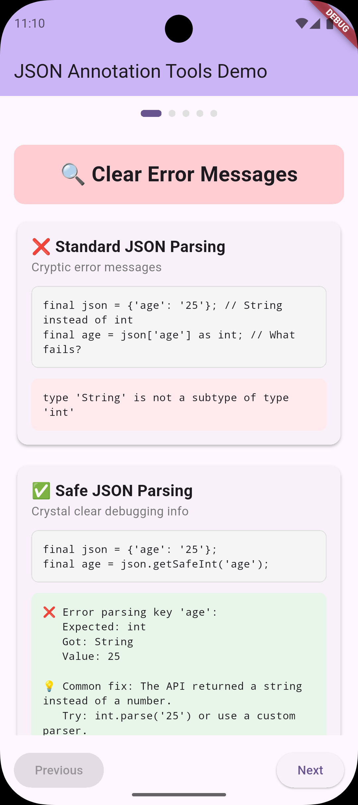
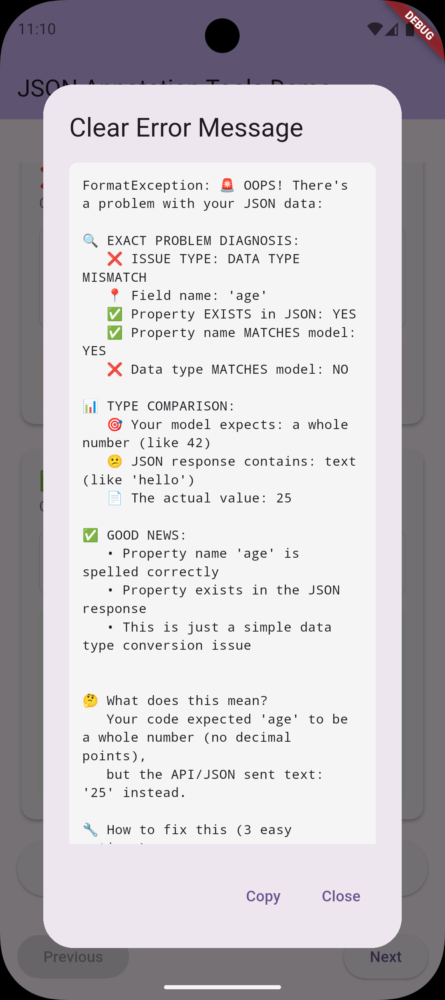

# JSON Annotation Tools 🛠️

[](https://pub.dev/packages/json_annotation_tools)
[](https://opensource.org/licenses/MIT)

**Stop wrestling with cryptic JSON parsing errors!** This package provides powerful debugging tools and safe parsing utilities that make JSON deserialization errors crystal clear and easy to fix.


*Before vs After: See how error messages transform from cryptic to crystal clear*

## 🎯 Why You Need This

Ever seen this frustrating error?
```
type 'String' is not a subtype of type 'int'
```

And spent hours figuring out which field in your JSON caused it? **Those days are over.**

### Before vs After

**❌ Before (Standard JSON parsing):**
```dart
// Unclear error: "type 'String' is not a subtype of type 'int'"
// Which field? What value? Who knows! 🤷‍♂️
User.fromJson(json);
```

**✅ After (With JSON Annotation Tools):**
```dart
// Crystal clear error message:
// "❌ Error parsing key 'age': expected int, but got String. Value: "25""
User.fromJsonSafe(json);
```


*🎬 See the complete debugging experience in action*

## 🚀 Features

### 🎯 **Revolutionary Code Generation**
- **🪄 Zero-Hassle Setup**: Just add `@SafeJsonParsing()` annotation - that's it!
- **🚀 Automatic Generation**: Build runner creates optimized safe parsing methods
- **⚡ Best Performance**: Generated code is as fast as hand-written safe parsing
- **🔧 Highly Customizable**: Field-level annotations for enhanced error context

### ⚡ **Manual Convenience Methods** 
- **🎯 Clean Convenience Methods**: `json.getSafeInt()`, `getSafeString()`, `getSafeBool()` and more!
- **🚀 No More Manual Parsers**: Gone are the days of `(v) => v as int` everywhere
- **⚡ Best Performance**: Same speed as manual parsing, but way cleaner code
- **🔧 Comprehensive Coverage**: 12+ convenience methods for all common types

### 📊 **Crystal-Clear Error Messages**
- **🔍 Pinpoint Error Location**: Know exactly which JSON field caused the parsing error
- **📝 Detailed Error Messages**: See the expected type, actual type, and problematic value
- **🧠 Smart Suggestions**: AI-powered field name suggestions for typos and mismatches
- **📋 Copy-Paste Solutions**: Ready-to-use code fixes for every error scenario

### 🛡️ **Bulletproof Parsing**
- **🛡️ Type Safety**: Catch type mismatches before they crash your app  
- **🚫 Missing Field Detection**: Clear warnings for missing required fields
- **🔄 Seamless Integration**: Works perfectly with `json_annotation` and `json_serializable`
- **⚡ Zero Performance Impact**: Only active during parsing errors
- **🌍 Cross-Platform**: Works on iOS, Android, Web, macOS, Windows, Linux

## 📱 Interactive Demo App

Experience the power of enhanced error messages with our interactive demo app:

<div align="center">
  
</div>

*Try all features live on Android, iOS, or Web!*

### What You'll See:
- **🚨 Real Error Comparisons**: Before vs after side-by-side
- **🔧 Copy-Paste Solutions**: Ready-to-use code fixes
- **🎯 Smart Suggestions**: AI-powered field name matching
- **🔍 Advanced Diagnostics**: Property mapping analysis
- **⚡ Live Testing**: Try different JSON scenarios instantly

## 📦 Installation

Add to your `pubspec.yaml`:

```yaml
dependencies:
  json_annotation_tools: ^0.1.6  # 🚀 Latest version!
  json_annotation: ^4.9.0

dev_dependencies:
  build_runner: ^2.4.12  # For @SafeJsonParsing() code generation
  json_serializable: ^6.8.0
```

## 🎮 Quick Start

### 🚀 **Zero-Hassle Code Generation** (Recommended)

Just add **one annotation** and get automatic safe parsing with enhanced error messages! ✨

#### **Step 0: Bootstrap with the CLI (recommended)**
```bash
# Adds @SafeJsonParsing() and part 'model.safe_json_parsing.g.dart';
dart run json_annotation_tools init

# Preview without writing changes
dart run json_annotation_tools init --dry-run
```

This scans your `lib/` folder for `@JsonSerializable` models, inserts the missing
`@SafeJsonParsing()` annotation, and ensures the extra `part` directive is present
so you can jump straight to code generation.

#### **Step 1: Annotate Your Model**
```dart
import 'package:json_annotation/json_annotation.dart';
import 'package:json_annotation_tools/json_annotation_tools.dart';

part 'user.g.dart';
part 'user.safe_json_parsing.g.dart';  // 🔥 This will be generated!

@JsonSerializable()
@SafeJsonParsing() // ← Magic happens with just this line!
class User {
  final int id;
  final String name;
  final int age;
  final String? email; // Nullable fields handled automatically
  
  User({required this.id, required this.name, required this.age, this.email});
  
  // Standard json_serializable methods (unchanged)
  factory User.fromJson(Map<String, dynamic> json) => _$UserFromJson(json);
  Map<String, dynamic> toJson() => _$UserToJson(this);
  
  // 🚀 AUTO-GENERATED: UserSafeJsonParsing.fromJsonSafe(json) method with enhanced errors!
}
```

#### **Step 2: Create build.yaml (one-time setup)**
```yaml
# build.yaml (in your project root)
targets:
  $default:
    builders:
      json_annotation_tools|safe_json_parsing:
        enabled: true
      json_serializable|json_serializable:
        enabled: true
```

#### **Step 3: Generate Code**
```bash
# Generate the safe parsing methods
flutter packages pub run build_runner build
# or
dart run build_runner build
```

#### **Step 4: Use Enhanced Parsing & See Error Messages**
```dart
final problematicJson = {
  'id': 'not-a-number', // ❌ Should be int, got String
  'name': 'John Doe',
  'age': 25,
  'email': 'john@example.com',
};

try {
  // 🚀 Use the auto-generated safe method
  final user = UserSafeJsonParsing.fromJsonSafe(problematicJson);
  print('Success: $user');
} catch (e) {
  // 🔍 Enhanced error message appears here!
  print('Enhanced Error: $e');
  
  /* Output:
  🚨 OOPS! There's a problem with your JSON data:
  
  🔍 EXACT PROBLEM DIAGNOSIS:
     ❌ Field 'id' has the wrong data type
  
  📊 TYPE COMPARISON:
     Expected: int (whole number)
     Got: String (text)
     Value: "not-a-number"
  
  🔧 How to fix this (3 easy options):
  1. Fix your API to return: {"id": 123}
  2. Update your model: final String id;
  3. Add conversion: int.tryParse(json['id'])
  */
}
```

#### Want zero call-site changes?

Create a single helper or service wrapper that always funnels through the generated safe method:

```dart
class UserParser {
  static User parse(Map<String, dynamic> json) =>
      UserSafeJsonParsing.fromJsonSafe(json);
}

// Use everywhere else
final user = UserParser.parse(apiResponse);
```

This keeps your UI/business layers unchanged while guaranteeing enhanced diagnostics.

#### **🎯 Key Benefits:**
- **🪄 Zero Manual Work**: Just add `@SafeJsonParsing()` annotation
- **🚀 Auto-Generated**: `UserSafeJsonParsing.fromJsonSafe()` method created automatically
- **⚡ Best Performance**: Generated code is as fast as hand-written safe parsing
- **🔍 Enhanced Errors**: Crystal-clear error messages built into generated method
- **🔧 Production Ready**: Perfect for error logging (Crashlytics/Sentry)

### ⚡ **Alternative: Manual Convenience Extensions**

Transform your JSON parsing from hassle to happiness with super clean convenience methods:

```dart
import 'package:json_annotation_tools/json_annotation_tools.dart';

@JsonSerializable()
class User {
  final int id;
  final String name;
  final int age;
  final String? email;
  
  User({required this.id, required this.name, required this.age, this.email});
  
  // Standard json_serializable methods (unchanged)
  factory User.fromJson(Map<String, dynamic> json) => _$UserFromJson(json);
  Map<String, dynamic> toJson() => _$UserToJson(this);
  
  // 🚀 ENHANCED: Safe parsing with crystal-clear error messages
  factory User.fromJsonSafe(Map<String, dynamic> json) {
    return User(
      id: json.getSafeInt('id'),           // Clean convenience methods!
      name: json.getSafeString('name'),     // No more manual parsers!
      age: json.getSafeInt('age'),         // Automatic type conversion!
      email: json.getNullableSafeString('email'), // Nullable support!
    );
  }
}
```

**Before vs After:**
```dart
// 😤 OLD WAY (Manual hassle):
id: json.getSafe('id', (v) => v as int),
name: json.getSafe('name', (v) => v as String),

// 🚀 NEW WAY (Clean convenience):
id: json.getSafeInt('id'),      // So much cleaner!
name: json.getSafeString('name'), // Zero hassle!
```

### 🔧 **Alternative: Custom Parsers** (For advanced control)

If you need maximum control with custom parsing logic:

```dart
import 'package:json_annotation_tools/json_annotation_tools.dart';

@JsonSerializable()
class User {
  final int id;
  final String name;
  final int age;
  
  User({required this.id, required this.name, required this.age});
  
  // Standard method
  factory User.fromJson(Map<String, dynamic> json) => _$UserFromJson(json);
  
  // Manual safe method with extensions
  factory User.fromJsonSafe(Map<String, dynamic> json) {
    return User(
      id: json.getSafeInt('id'),     // Convenience methods
      name: json.getSafeString('name'),
      age: json.getSafeInt('age'),
    );
  }
}
```

### 3. Handle problematic JSON gracefully

```dart
final problematicJson = {
  'id': 123,
  'name': 'John Doe',
  'age': '25', // Oops! String instead of int
};

try {
  final user = User.fromJsonSafe(problematicJson);
} catch (e) {
  print(e);
  // Output: ❌ Error parsing key 'age': expected int, but got String. Value: "25"
  // Now you know exactly what to fix!
}
```

## 🧰 Command-Line Setup Assistant

Make onboarding effortless with the bundled CLI:

```bash
dart run json_annotation_tools init
```

- **Annotates automatically** – adds `@SafeJsonParsing()` next to every `@JsonSerializable` model.
- **Fixes missing part files** – ensures `part 'model.safe_json_parsing.g.dart';` is present.
- **Dry-run friendly** – append `--dry-run` to preview the diff.
- **Verbose mode** – use `--verbose` to list already compliant files.

💡 Tip: add this to a pre-commit hook or CI check so new models always ship with safe parsing baked in.

## 🎯 Real-World Examples

### 🔍 **How to See Enhanced Error Messages**

The most common question: *"I added @SafeJsonParsing(), but how do I see the enhanced error messages?"*

**Answer: Use try-catch with the generated method!**

```dart
// ❌ WRONG: Using standard method (cryptic errors)
final user = User.fromJson(problematicJson); // Type 'String' is not a subtype...

// ✅ CORRECT: Using generated safe method (enhanced errors)
try {
  final user = UserSafeJsonParsing.fromJsonSafe(problematicJson);
  print('Success: $user');
} catch (e) {
  print('📋 Full Enhanced Error:');
  print(e.toString()); // 🔍 See complete detailed diagnosis here!
  
  // 🏭 In production, log this to your error service:
  // crashlytics.recordError(e, null);
  // logger.error('JSON parsing failed: ${e.toString()}');
}
```

### 🚀 **Production API Service Pattern**

```dart
// Example API service using @SafeJsonParsing()
class UserService {
  Future<User> fetchUser(int id) async {
    try {
      final response = await dio.get('/api/users/$id');
      
      // 🚀 Use auto-generated safe method with enhanced errors
      return UserSafeJsonParsing.fromJsonSafe(response.data);
      
    } catch (e) {
      // 📝 Enhanced error messages help debug API issues 10x faster
      logger.error('User parsing failed for ID $id: ${e.toString()}');
      
      // 🎯 Show user-friendly message
      throw UserFetchException('Unable to load user data');
    }
  }
}
```

### 🔧 **Advanced Field-Level Configuration**

```dart
@JsonSerializable()
@SafeJsonParsing(
  validateRequiredKeys: true,  // Check all keys exist first
  methodName: 'parseProductSafe'  // Custom method name
)
class Product {
  final String id;
  
  @SafeJsonField(
    description: 'Product price in USD',
    expectedFormat: 'Positive number (e.g., 19.99)',
    commonValues: ['9.99', '19.99', '29.99'],
  )
  final double price;
  
  @JsonKey(name: 'is_available')
  @SafeJsonField(
    description: 'Product availability status',
    commonValues: ['true', 'false'],
  )
  final bool isAvailable;
  
  // 🚀 AUTO-GENERATED: ProductSafeJsonParsing.parseProductSafe(json)
  // Enhanced errors include field descriptions and common values!
}
```

### API Response Debugging
```dart
// When your API suddenly returns unexpected data types
final apiResponse = {
  'user_id': '12345',    // Should be int, but API returned string
  'balance': 'null',     // Should be double, but got string "null"
  'premium': 1,          // Should be bool, but got int
};

// Get clear, actionable error messages:
try {
  final user = UserSafeJsonParsing.fromJsonSafe(apiResponse);
} catch (e) {
  print(e);
  /* Enhanced Output:
  🚨 OOPS! There's a problem with your JSON data:
  
  🔍 EXACT PROBLEM DIAGNOSIS:
     ❌ Field 'user_id' has the wrong data type
  
  📊 TYPE COMPARISON:
     Expected: int (whole number)
     Got: String (text)
     Value: "12345"
     
  🔧 How to fix this (copy-paste ready):
  1. Fix your API to return: {"user_id": 12345}
  2. Update your model: final String user_id;
  3. Add conversion: int.tryParse(json['user_id'])
  */
  
  // Now you can immediately contact the backend team with specific details!
}
```

### Nullable Fields Made Easy
```dart
factory User.fromJsonSafe(Map<String, dynamic> json) {
  return User(
    id: json.getSafe('id', (v) => v as int),
    name: json.getSafe('name', (v) => v as String),
    age: json.getSafe('age', (v) => v as int),
    // Optional fields with safe parsing
    email: json.getNullableSafe('email', (v) => v as String),
    phoneNumber: json.getNullableSafe('phone', (v) => v as String),
  );
}
```

### Complex Type Parsing
```dart
// Parse nested objects and lists safely
factory Order.fromJsonSafe(Map<String, dynamic> json) {  
  return Order(
    id: json.getSafe('id', (v) => v as String),
    items: json.getSafe('items', (v) => 
      (v as List).map((item) => OrderItem.fromJsonSafe(item)).toList()
    ),
    totalAmount: json.getSafe('total', (v) => (v as num).toDouble()),
    createdAt: json.getSafe('created_at', (v) => DateTime.parse(v as String)),
  );
}
```

## 🔧 Advanced Usage

### Custom Parser Functions
```dart
// Create reusable parsers for common patterns
T parseEnum<T>(List<T> values, dynamic value) {
  final stringValue = value as String;
  return values.firstWhere(
    (e) => e.toString().split('.').last == stringValue,
    orElse: () => throw FormatException('Invalid enum value: $stringValue'),
  );
}

// Use in your models
factory UserStatus.fromJsonSafe(Map<String, dynamic> json) {
  return UserStatus(
    status: json.getSafe('status', (v) => parseEnum(StatusType.values, v)),
  );
}
```

### Debugging Production Issues
```dart
// Add logging to track parsing issues in production
factory User.fromJsonSafe(Map<String, dynamic> json) {
  try {
    return User(
      id: json.getSafe('id', (v) => v as int),
      name: json.getSafe('name', (v) => v as String),
      age: json.getSafe('age', (v) => v as int),
    );
  } catch (e) {
    // Log the error with full context for debugging
    FirebaseCrashlytics.instance.recordError(
      e, 
      null, 
      fatal: false,
      information: ['JSON: ${jsonEncode(json)}'],
    );
    rethrow;
  }
}
```

## 🎨 Best Practices

1. **Keep Both Methods**: Maintain both `fromJson` and `fromJsonSafe` for backward compatibility
2. **Use in Development**: Use `fromJsonSafe` during development and testing
3. **Production Strategy**: Consider using `fromJsonSafe` in production for critical models
4. **Error Handling**: Always wrap safe parsing in try-catch blocks
5. **Logging**: Log parsing errors with full context for debugging

## 🔗 Works Great With Your Stack

Perfect integration with Dio, Retrofit, and json_annotation - use the same safe parsing methods with your existing API client setup.

## 🎮 Usage Examples

### Code Generation Example
```dart
@JsonSerializable()
@SafeJsonParsing(
  validateRequiredKeys: true,  // Validate all keys exist first
  methodName: 'parseJsonSafe'  // Custom method name
)
class Product {
  @SafeJsonField(
    description: 'Product price in USD',
    expectedFormat: 'Positive number (e.g., 19.99)',
    commonValues: ['9.99', '19.99', '29.99'],
  )
  final double price;
  
  @JsonKey(name: 'is_available')
  final bool isAvailable;
  
  // Constructor and standard methods...
  
  // 🚀 AUTO-GENERATED: Product.parseJsonSafe(json) with enhanced errors!
}
```

## 📟 CLI Command Cheat Sheet

```bash
# Auto-annotate @JsonSerializable models with @SafeJsonParsing()
flutter pub run json_annotation_tools init

# Preview changes without writing them
flutter pub run json_annotation_tools init --dry-run

# Regenerate JSON + safe parsing code
flutter pub run build_runner build --delete-conflicting-outputs

# Optional helper to demo the enhanced error output
dart run tool/demo_safe_json_error.dart
```

## 🔧 Handling Errors

- Prefer the generated `ModelSafeJsonParsing.fromJsonSafe(json)` whenever you deserialize API data.
- Catch `FormatException` at the repository/data-source layer and log or remap it once.
- Fall back to manual helpers like `json.getSafeInt('field')` when a model cannot be annotated.
- Use `@SafeJsonConfig` if you need global interception/logging without touching each call site.

```dart
try {
  final summary = DoctorSummarySafeJsonParsing.fromJsonSafe(payload);
} on FormatException catch (error) {
  logger.error('JSON mismatch: ${error.message}');
  throw DataParseFailure.fromServer(error.message);
}
```

## 🧪 Testing & Debugging

- `flutter test test/safe_json_parsing_test.dart` – regression test that asserts on the enhanced message.
- `dart run tool/demo_safe_json_error.dart` – prints the full diagnostic for a controlled payload.
- `rg "SafeJsonParsing" -g"*.g.dart"` – quick audit to check which models already have safe parsers.
- Consider golden tests around high-value endpoints to lock in the detailed error copy.

## 🤝 Migration Guide

### From Standard JSON Serialization

1. **Keep existing code working**: Your current `fromJson` methods continue to work
2. **Add safe alternatives**: Create `fromJsonSafe` methods alongside existing ones
3. **Test thoroughly**: Use `fromJsonSafe` in tests to catch issues early
4. **Gradual adoption**: Migrate critical models first, then expand usage

## 📊 Performance Impact

- **Zero overhead** during successful parsing
- **Minimal impact** during errors (only when you need the debugging info)
- **Same memory usage** as standard parsing
- **Compatible** with all existing JSON serialization patterns

## 🌍 Platform Support

This package works seamlessly across all Flutter/Dart platforms:

### ✅ **Fully Supported Platforms:**
- **📱 iOS**: Native iOS apps (iPhone/iPad)
- **🤖 Android**: Native Android apps (phones/tablets)  
- **🌐 Web**: Progressive Web Apps (PWA) and web browsers
- **💻 macOS**: Native desktop apps
- **🪟 Windows**: Native desktop apps
- **🐧 Linux**: Native desktop apps

### 📦 **Package Type:**
- **Pure Dart package** - no platform-specific code
- **No native dependencies** - works everywhere Flutter works
- **Same API** across all platforms
- **Consistent behavior** regardless of target platform

### 🎮 **Try the Demo:**
Run our interactive example app to test on your preferred platform:

```bash
# iOS (requires Xcode and iOS Simulator/Device)
cd example_app && flutter run -d ios

# Android (requires Android SDK and Emulator/Device)  
cd example_app && flutter run -d android

# Web (opens in default browser)
cd example_app && flutter run -d chrome

# macOS (requires macOS development setup)
cd example_app && flutter run -d macos

# Windows (requires Windows development setup)
cd example_app && flutter run -d windows

# Linux (requires Linux development setup)
cd example_app && flutter run -d linux

# Generate a static web build ready for hosting (Netlify/GitHub Pages/etc.)
cd example_app && flutter build web --release
```

## 🐛 Troubleshooting

### Common Issues

**Q: "I'm getting errors about missing keys"**
```dart
// Use getNullableSafe for optional fields
email: json.getNullableSafe('email', (v) => v as String),
```

**Q: "How do I handle nested objects?"**
```dart
// Parse nested objects recursively
address: json.getSafe('address', (v) => Address.fromJsonSafe(v as Map<String, dynamic>)),
```

**Q: "Can I use this with existing json_serializable models?"**
```dart
// Yes! Add safe methods alongside generated ones
factory User.fromJson(Map<String, dynamic> json) => _$UserFromJson(json); // Generated
factory User.fromJsonSafe(Map<String, dynamic> json) { /* Your safe implementation */ }
```

## 🤝 Contributing

We welcome contributions! Here's how to get involved:

### 🐛 **Report Issues:**
Found a bug or have a feature request? 
- **Create an issue**: https://github.com/khokanuzzaman/json_annotation_tools/issues
- **Include details**: Error messages, code examples, expected vs actual behavior

### 💡 **Contribute Code:**
1. **Fork** the repository: https://github.com/khokanuzzaman/json_annotation_tools
2. **Create** a feature branch: `git checkout -b feature/amazing-feature`
3. **Commit** your changes: `git commit -m 'Add amazing feature'`
4. **Push** to branch: `git push origin feature/amazing-feature`
5. **Open** a Pull Request

### 📖 **Improve Documentation:**
- Fix typos or unclear explanations
- Add more examples or use cases
- Enhance visual documentation

### 🧪 **Add Tests:**
- Write tests for new features
- Improve existing test coverage
- Add edge case testing

Please see our [Contributing Guide](CONTRIBUTING.md) for detailed guidelines.

## 📄 License

This project is licensed under the MIT License - see the [LICENSE](LICENSE) file for details.

## 🙏 Acknowledgments

- Built to complement the excellent `json_annotation` and `json_serializable` packages
- Inspired by the need for better JSON debugging in Flutter development
- Thanks to the Flutter community for feedback and suggestions

---

**Made with ❤️ for the Flutter community**

*Stop debugging JSON parsing errors in the dark - see exactly what's wrong and fix it fast!*
