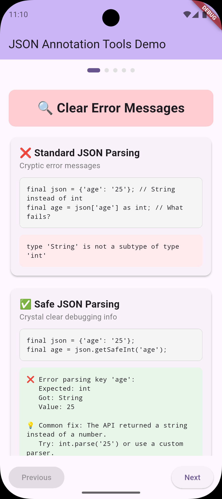
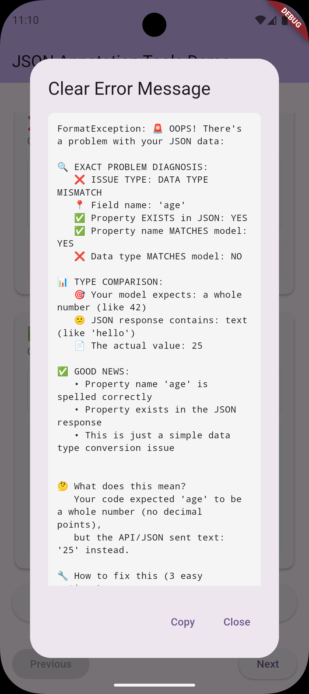

# JSON Annotation Tools 🛠️

[](https://pub.dev/packages/json_annotation_tools)
[](https://opensource.org/licenses/MIT)

**Stop wrestling with cryptic JSON parsing errors!** This package provides powerful debugging tools and safe parsing utilities that make JSON deserialization errors crystal clear and easy to fix.


*Before vs After: See how error messages transform from cryptic to crystal clear*

## 🎯 Why You Need This

Ever seen this frustrating error?
```
type 'String' is not a subtype of type 'int'
```

And spent hours figuring out which field in your JSON caused it? **Those days are over.**

### Before vs After

**❌ Before (Standard JSON parsing):**
```dart
// Unclear error: "type 'String' is not a subtype of type 'int'"
// Which field? What value? Who knows! 🤷‍♂️
User.fromJson(json);
```

**✅ After (With JSON Annotation Tools):**
```dart
// Crystal clear error message:
// "❌ Error parsing key 'age': expected int, but got String. Value: "25""
User.fromJsonSafe(json);
```


*🎬 See the complete debugging experience in action*

## 🚀 Features

- **🔍 Pinpoint Error Location**: Know exactly which JSON field caused the parsing error
- **📝 Detailed Error Messages**: See the expected type, actual type, and problematic value
- **🛡️ Type Safety**: Catch type mismatches before they crash your app  
- **🚫 Missing Field Detection**: Clear warnings for missing required fields
- **🔄 Seamless Integration**: Works perfectly with `json_annotation` and `json_serializable`
- **⚡ Zero Performance Impact**: Only active during parsing errors

## 📱 Interactive Demo App

Experience the power of enhanced error messages with our interactive demo app:

<div align="center">
  
</div>

*Try all features live on Android, iOS, or Web!*

### What You'll See:
- **🚨 Real Error Comparisons**: Before vs after side-by-side
- **🔧 Copy-Paste Solutions**: Ready-to-use code fixes
- **🎯 Smart Suggestions**: AI-powered field name matching
- **🔍 Advanced Diagnostics**: Property mapping analysis
- **⚡ Live Testing**: Try different JSON scenarios instantly

## 📦 Installation

Add to your `pubspec.yaml`:

```yaml
dependencies:
  json_annotation_tools: ^0.0.1
  json_annotation: ^4.9.0
```

## 🎮 Quick Start

### 1. Import the package
```dart
import 'package:json_annotation_tools/json_annotation_tools.dart';
```

### 2. Use in your JSON models

**Traditional approach (error-prone):**
```dart
@JsonSerializable()
class User {
  final int id;
  final String name;
  final int age;
  
  User({required this.id, required this.name, required this.age});
  
  factory User.fromJson(Map<String, dynamic> json) => _$UserFromJson(json);
}
```

**Enhanced approach (bulletproof):**
```dart
@JsonSerializable()
class User {
  final int id;
  final String name;
  final int age;
  
  User({required this.id, required this.name, required this.age});
  
  // Original method (keep for compatibility)
  factory User.fromJson(Map<String, dynamic> json) => _$UserFromJson(json);
  
  // Enhanced method with detailed error reporting
  factory User.fromJsonSafe(Map<String, dynamic> json) {
    return User(
      id: json.getSafe('id', (v) => v as int),
      name: json.getSafe('name', (v) => v as String),
      age: json.getSafe('age', (v) => v as int),
    );
  }
}
```

### 3. Handle problematic JSON gracefully

```dart
final problematicJson = {
  'id': 123,
  'name': 'John Doe',
  'age': '25', // Oops! String instead of int
};

try {
  final user = User.fromJsonSafe(problematicJson);
} catch (e) {
  print(e);
  // Output: ❌ Error parsing key 'age': expected int, but got String. Value: "25"
  // Now you know exactly what to fix!
}
```

## 🎯 Real-World Examples

### API Response Debugging
```dart
// When your API suddenly returns unexpected data types
final apiResponse = {
  'user_id': '12345',    // Should be int, but API returned string
  'balance': 'null',     // Should be double, but got string "null"
  'premium': 1,          // Should be bool, but got int
};

// Get clear, actionable error messages:
try {
  final user = User.fromJsonSafe(apiResponse);
} catch (e) {
  // ❌ Error parsing key 'user_id': expected int, but got String. Value: "12345"
  // Now you can immediately contact the backend team with specific details!
}
```

### Nullable Fields Made Easy
```dart
factory User.fromJsonSafe(Map<String, dynamic> json) {
  return User(
    id: json.getSafe('id', (v) => v as int),
    name: json.getSafe('name', (v) => v as String),
    age: json.getSafe('age', (v) => v as int),
    // Optional fields with safe parsing
    email: json.getNullableSafe('email', (v) => v as String),
    phoneNumber: json.getNullableSafe('phone', (v) => v as String),
  );
}
```

### Complex Type Parsing
```dart
// Parse nested objects and lists safely
factory Order.fromJsonSafe(Map<String, dynamic> json) {  
  return Order(
    id: json.getSafe('id', (v) => v as String),
    items: json.getSafe('items', (v) => 
      (v as List).map((item) => OrderItem.fromJsonSafe(item)).toList()
    ),
    totalAmount: json.getSafe('total', (v) => (v as num).toDouble()),
    createdAt: json.getSafe('created_at', (v) => DateTime.parse(v as String)),
  );
}
```

## 🔧 Advanced Usage

### Custom Parser Functions
```dart
// Create reusable parsers for common patterns
T parseEnum<T>(List<T> values, dynamic value) {
  final stringValue = value as String;
  return values.firstWhere(
    (e) => e.toString().split('.').last == stringValue,
    orElse: () => throw FormatException('Invalid enum value: $stringValue'),
  );
}

// Use in your models
factory UserStatus.fromJsonSafe(Map<String, dynamic> json) {
  return UserStatus(
    status: json.getSafe('status', (v) => parseEnum(StatusType.values, v)),
  );
}
```

### Debugging Production Issues
```dart
// Add logging to track parsing issues in production
factory User.fromJsonSafe(Map<String, dynamic> json) {
  try {
    return User(
      id: json.getSafe('id', (v) => v as int),
      name: json.getSafe('name', (v) => v as String),
      age: json.getSafe('age', (v) => v as int),
    );
  } catch (e) {
    // Log the error with full context for debugging
    FirebaseCrashlytics.instance.recordError(
      e, 
      null, 
      fatal: false,
      information: ['JSON: ${jsonEncode(json)}'],
    );
    rethrow;
  }
}
```

## 🎨 Best Practices

1. **Keep Both Methods**: Maintain both `fromJson` and `fromJsonSafe` for backward compatibility
2. **Use in Development**: Use `fromJsonSafe` during development and testing
3. **Production Strategy**: Consider using `fromJsonSafe` in production for critical models
4. **Error Handling**: Always wrap safe parsing in try-catch blocks
5. **Logging**: Log parsing errors with full context for debugging

## 🔗 Works Great With Your Stack

Perfect integration with Dio, Retrofit, and json_annotation - use the same safe parsing methods with your existing API client setup.

## 🤝 Migration Guide

### From Standard JSON Serialization

1. **Keep existing code working**: Your current `fromJson` methods continue to work
2. **Add safe alternatives**: Create `fromJsonSafe` methods alongside existing ones
3. **Test thoroughly**: Use `fromJsonSafe` in tests to catch issues early
4. **Gradual adoption**: Migrate critical models first, then expand usage

## 📊 Performance Impact

- **Zero overhead** during successful parsing
- **Minimal impact** during errors (only when you need the debugging info)
- **Same memory usage** as standard parsing
- **Compatible** with all existing JSON serialization patterns

## 🐛 Troubleshooting

### Common Issues

**Q: "I'm getting errors about missing keys"**
```dart
// Use getNullableSafe for optional fields
email: json.getNullableSafe('email', (v) => v as String),
```

**Q: "How do I handle nested objects?"**
```dart
// Parse nested objects recursively
address: json.getSafe('address', (v) => Address.fromJsonSafe(v as Map<String, dynamic>)),
```

**Q: "Can I use this with existing json_serializable models?"**
```dart
// Yes! Add safe methods alongside generated ones
factory User.fromJson(Map<String, dynamic> json) => _$UserFromJson(json); // Generated
factory User.fromJsonSafe(Map<String, dynamic> json) { /* Your safe implementation */ }
```

## 🤝 Contributing

We welcome contributions! Please see our [Contributing Guide](CONTRIBUTING.md) for details.

## 📄 License

This project is licensed under the MIT License - see the [LICENSE](LICENSE) file for details.

## 🙏 Acknowledgments

- Built to complement the excellent `json_annotation` and `json_serializable` packages
- Inspired by the need for better JSON debugging in Flutter development
- Thanks to the Flutter community for feedback and suggestions

---

**Made with ❤️ for the Flutter community**

*Stop debugging JSON parsing errors in the dark - see exactly what's wrong and fix it fast!*
